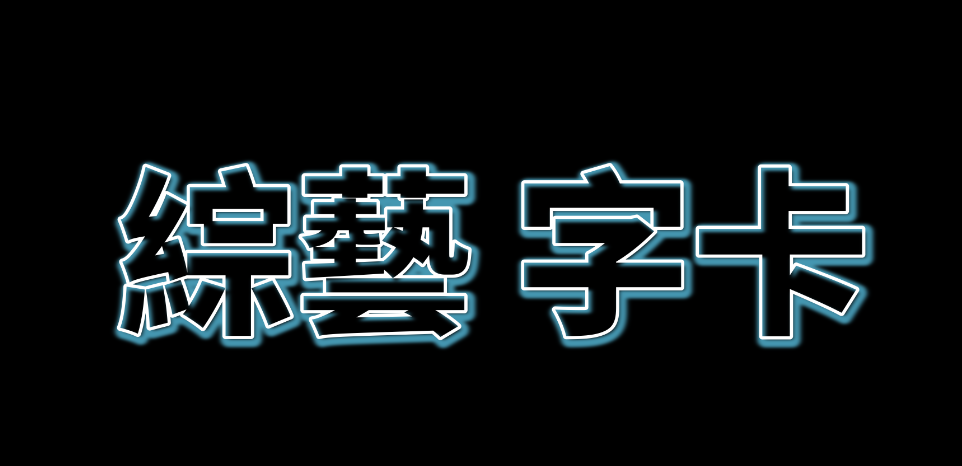

# 使用教程

## 下載字體（可選）
本達文西項目使用到的免費開源字體文件，你也可以使用自己喜歡的字體文件，這一步不是必須的。

## 下載達文西項目文件（Artwords.drp）
字卡效果預覽:

#### 金屬感

#### 霓虹燈

#### 卡通

#### 標籤

#### 透明

#### 漸變色

#### 條紋

#### 方塊

#### 科技感

#### 康熙來了

