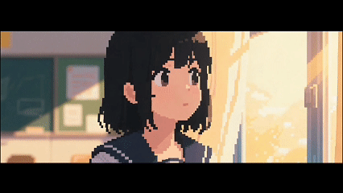
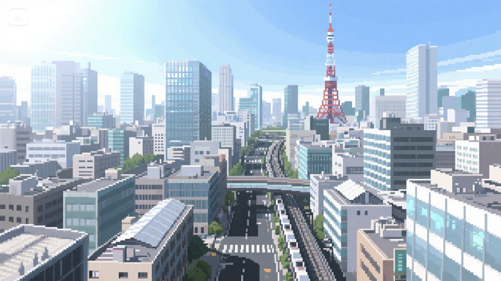
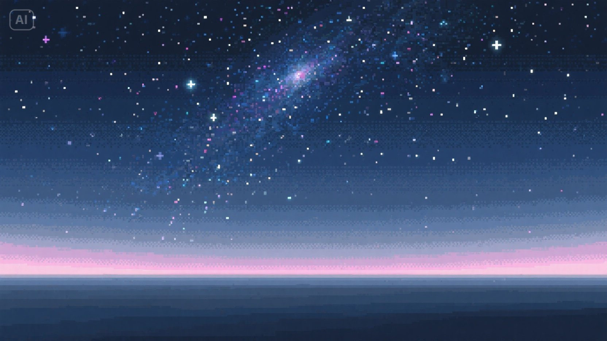
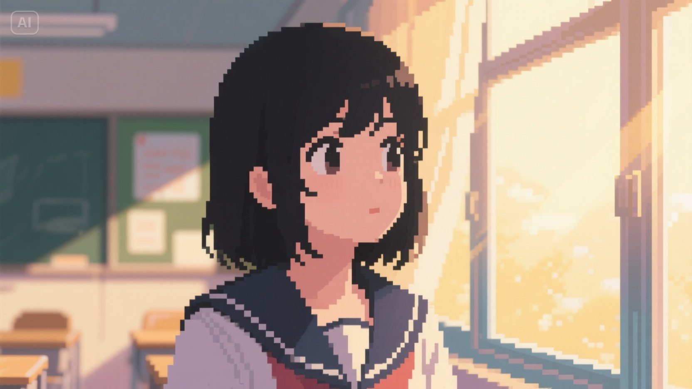
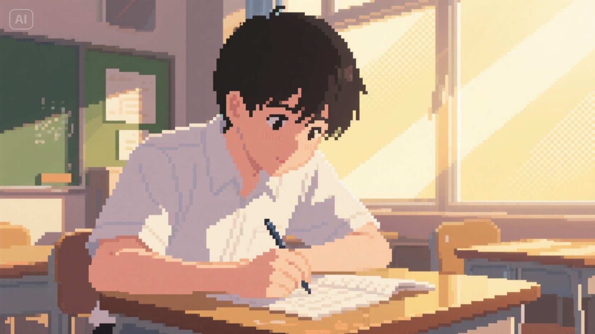
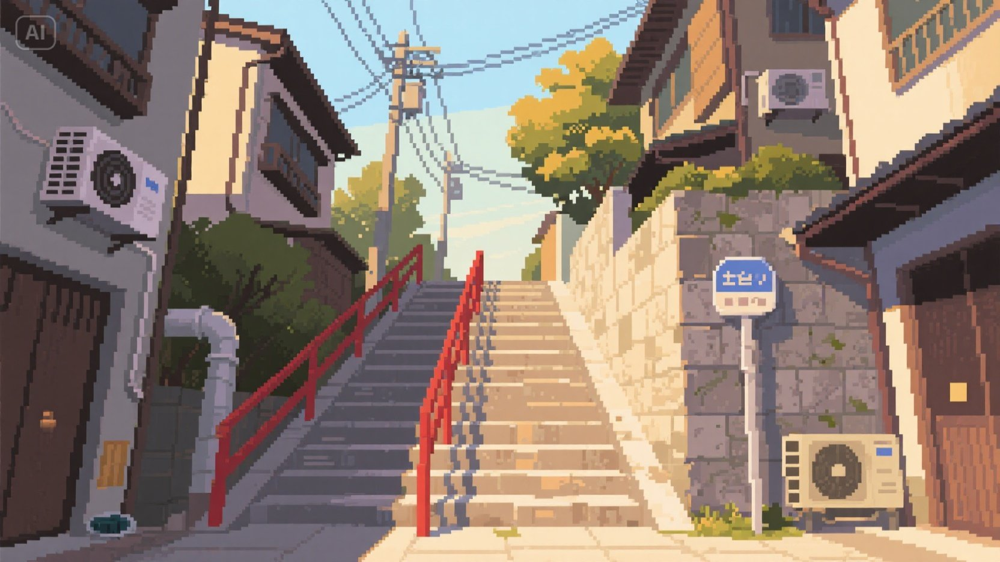

## AI像素风插画Prompts示例




### 城市：

pixel art style, 16-bit, texture, flat 2D perspective, front-facing, wide shot. long urban staircase stretching upward between narrow Japanese houses, red railings, overhead power lines. traditional city alley elements like drainpipes, AC units, and stone signpost. soft afternoon sunlight filtering through trees, casting diagonal shadows on steps and walls. pixel grid, sharp edges, hard outlines, warm color palette, nostalgic and tranquil atmosphere.

### 星空：

pixel art style, 16-bit, texture, flat 2D perspective, front-facing, wide shot.A panoramic view of a dense star field fades into darkness, filled with subtle color gradients and glimmers of distant galaxies.No ground or elements—pure horizontal starlight.Uniform star distribution, varying brightness.Subtle glow along horizon band, soft hue blending.Pre-dawn quiet.Flat emotional tone—contemplative and boundless.pixel grid, flat color fill, speckled light points, minimalistic pattern.Color scheme: midnight blue, grey-white, soft magenta.Theme: tranquil, infinite, meditative.

### 小女孩：

pixel art style, 16-bit, texture, flat 2D perspective, front-facing, close-up. Japanese high school classroom window background, blurred details, golden sunlight shining diagonally across face, black-haired schoolgirl gazing quietly outside, expression calm and thoughtful. pixelated skin and hair texture, soft rim lighting on hair strands, flat color with slight gradient, warm pastel tones, early afternoon setting. pixel grid, sharp edges, nostalgic atmosphere.

### 小男孩：

pixel art style, 16-bit, texture, flat 2D perspective, front-facing, close-up. Japanese high school classroom window background, blurred details, golden sunlight shining diagonally across desk and student’s face, black-haired male student leaning slightly forward, focused on writing homework, expression calm and concentrated. pixelated skin and hair texture, soft rim lighting on hair strands and hand, flat color with slight gradient, warm pastel tones, early afternoon setting. pixel grid, sharp edges, nostalgic atmosphere.

### 街道：

pixel art style, 16-bit, texture, flat 2D perspective, aerial view, wide shot.A densely packed Tokyo city center under bright daylight, layered buildings and main avenues stretch into the distance.High-rise towers, Tokyo Tower silhouette, highways, trains.Pixelated concrete, glass reflections, metal rooftops.Sunlight casting sharp shadows from southeast direction.Midday.No characters, purely urban structure.pixel grid, sharp edges, layered architecture, subtle reflections.Color scheme: grey-white, light blue, metallic silver, asphalt black.Theme: modern, bustling, structured.


### 通用Prompts：
```
當我給出題材時，根據所給出的信息編寫繪圖AI可以識別的生圖提示詞，提供5組可直接使用的生圖提示詞，並分別解釋場景的要素和內容，減少透視感，2D，藝術視角構圖(俯視角、仰視角、航拍視角、正面視角)，景別設定(中景、近景、遠景、特寫)，風格根據我的題材提煉以下示例

主題：富士山，森林，湖泊，陽光明媚，廣角

生成格式如下：
pixel art style, 16-bit, texture, flat 2D perspective, [藝術視角], [景別]. [場景環境描述], [建築與元素], [材質細節], [光影方向與色調], [時間設定]. [角色動作或氛圍], [像素風格強化關鍵詞], [色彩方案], [主題氛圍關鍵詞].

推薦關鍵詞示例庫：
視角選項：top-down/front-facing/aerial view/isometric
景別選項：close-up/medium shot/wide shot
風格選項：16-bit/low-res/retro/high contrast
環境元素：city street/forest/underwater ruins/desert market/space station
光影效果：sunlight/neon glow/dusk light/moonlight/rim lighting
材質描寫：pixelated stone/moss/neon sign/brick wall/glowing water
氛圍情感：nostalgic/cyberpunk/magical/gloomy/bustling/tranquil

特別說明：
- 保持 pixel art 專屬的關鍵詞：pixel grid, sharp edges, flat color, hard outlines 等
- 可自由增減風格模塊，生成多個版本時請保持核心主題一致
- 每一組都要用中文簡單概述一下內容
```

